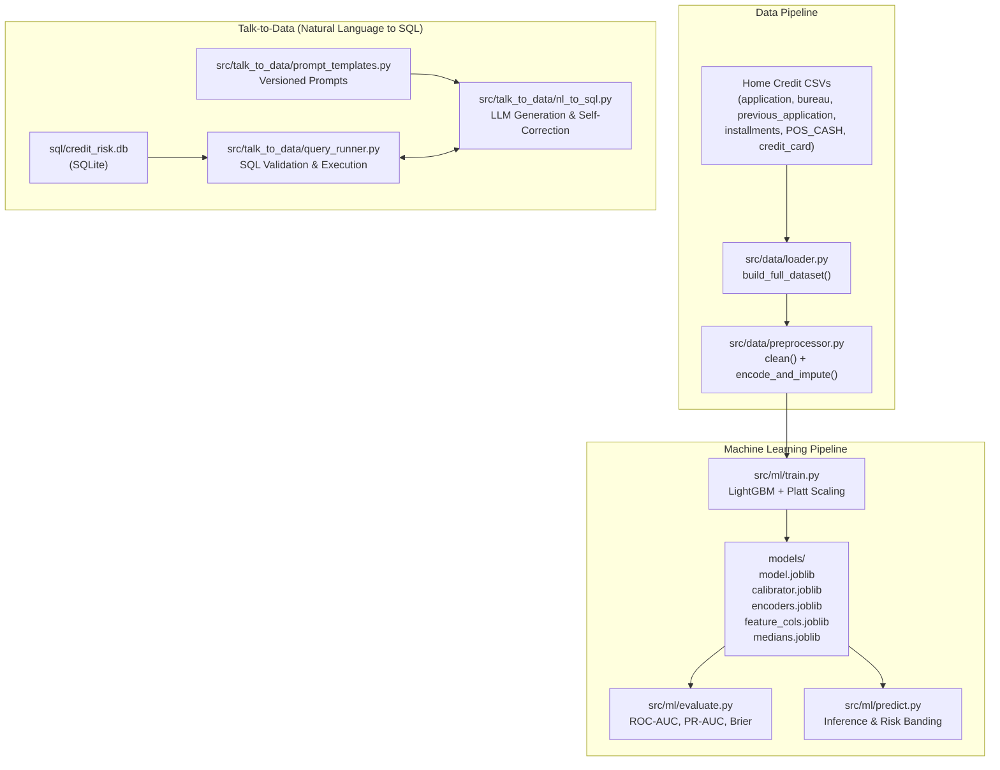

# Credit Risk Intelligence Platform

An end-to-end credit scoring and conversational data analytics platform trained on the Home Credit Default Risk dataset.

## Architecture



## Project Structure

```
credit_risk_platform/
├── data/                               # Home Credit dataset files
├── documents/
│   └── project_presentation.pdf       # Project presentation
├── notebooks/
│   ├── eda.ipynb                      # Exploratory Data Analysis notebook
│   └── eda.py                         # Converted EDA script
├── src/
│   ├── data/
│   │   ├── loader.py                  # Load and aggregate multi-table dataset
│   │   └── preprocessor.py            # Cleaning, encoding, and imputation
│   ├── ml/
│   │   ├── train.py                   # Model training and Platt calibration
│   │   ├── predict.py                 # Inference and calibrated risk banding
│   │   └── evaluate.py                # ROC-AUC, PR-AUC, and Brier score evaluation
│   ├── talk_to_data/
│   │   ├── nl_to_sql.py               # Natural language to SQL query engine
│   │   ├── query_runner.py            # SQL validation and execution
│   │   └── prompt_templates.py        # Versioned prompt templates
│   └── utils/
│       ├── logger.py                  # Standard logging setup
│       ├── config.py                  # Configuration loader
│       ├── helpers.py                 # Serialization and helper utilities
│       └── docker_utils.py            # Path resolution utilities
├── sql/
│   └── schema.sql                     # Reference database schema
├── models/                             # Trained model weights and calibration artifacts
├── Dockerfile                         # Container definition
├── docker-compose.yml                 # Multi-container deployment configuration
├── requirements.txt                   # Python dependencies
├── .gitignore                         # Git exclusion rules
└── README.md                          # Documentation
```

## Setup & Installation

### Prerequisites
- Python 3.11+
- Home Credit Default Risk CSV files placed into `data/`

### 1. Install Dependencies
```bash
pip install -r requirements.txt
```

### 2. Environment Configuration
Export your LLM API credentials if using the Talk-to-Data feature:
```bash
export OPENAI_API_KEY="your-api-key"
export LLM_PROVIDER="openai" # or "groq"
export LLM_MODEL="gpt-4o-mini"
```

### 3. Model Training & Evaluation
Train the LightGBM classifier with Platt calibration:
```bash
python -m src.ml.train
python -m src.ml.evaluate
```

### 4. Running Exploratory Data Analysis
```bash
python notebooks/eda.py
```

### 5. Docker Deployment
```bash
docker-compose up --build
```

## Model Architecture & Training

- **Classifier:** LightGBM (`LGBMClassifier`) tuned for tabular credit risk data.
- **Class Imbalance Strategy:** Handled dynamically via `scale_pos_weight` (~11.39) calculated from class frequencies.
- **Probability Calibration (Platt Scaling):** A logistic regression calibrator is fitted on logit transforms of out-of-fold validation predictions. This aligns model output with real-world default probabilities (~8.07% population default rate) while strictly maintaining discriminative rank-ordering (identical ROC-AUC).
- **Inference Stability:** Training-set numeric medians (`medians.joblib`) are persisted to ensure single-record and batch inference have identical imputation values, eliminating train/serve skew.

### Performance Metrics

| Metric | Raw Uncalibrated | Platt Calibrated |
|---|---|---|
| ROC-AUC | 0.7735 | 0.7735 |
| PR-AUC | 0.2665 | 0.2665 |
| Brier Score Loss | 0.1819 | **0.0667** (-63.3%) |
| Mean Predicted Probability | 38.90% | **8.07%** |
| Recall (Class 1) | 0.69 | 0.69 |
| Precision (Class 1) | 0.18 | 0.18 |

### Risk Bands

- **Low Risk (PD < 5%):** Observed default rate ~1.7%
- **Medium Risk (5% ≤ PD < 15%):** Observed default rate ~8.5%
- **High Risk (PD ≥ 15%):** Observed default rate ~26.8% (3.3x population base rate)

### Fair Lending & Responsible ML Notice

`CODE_GENDER` appears among the model's input features per the raw Home Credit schema and may surface as a SHAP driver in individual explanations. Using gender as a live input to a credit decision is a genuine fair-lending concern under regulations such as ECOA and SR 11-7. A production deployment would require a fairness/disparate-impact review before retaining this feature as a model input. This platform retains it in its research configuration for transparency, but flags it here as a known consideration for any downstream deployment.

## Talk-to-Data Engine

The `src/talk_to_data/` module provides natural language querying over applicant data:
- **SQL Validation:** Strict validation ensures only single-statement `SELECT` queries execute. Any modification commands (`INSERT`, `UPDATE`, `DELETE`, `DROP`, `ALTER`, `ATTACH`, `PRAGMA`) are blocked before database execution.
- **Self-Correction Loop:** If an initial SQL query triggers a syntax or schema error, `correct_sql()` passes the error back to the LLM to generate an adjusted query.
- **Transparent Metric Substitution:** When users request metrics not directly present in the dataset (such as FICO scores or debt-to-income ratios), the engine discloses that the metric is not tracked and explains any proxy computation used, including how it differs from the standard industry definition.
- **Adversarial Input Guardrails:** User questions are pre-screened for destructive SQL keywords (`DELETE`, `DROP`, `TRUNCATE`, etc.), prompt-injection patterns (`ignore previous instructions`, `act as`, etc.), and excessive length (>500 chars) before any LLM call is made. Rejected queries return a friendly warning without consuming API resources.
- **Result Size Limits:** Row-level queries are prompted with `LIMIT 25` by default, and the answer synthesis step truncates results to 50 rows before sending to the LLM to prevent token-limit errors.

### Example Queries

```
Q: "How many applicants fall into the High risk band?"
SQL: SELECT COUNT(*) FROM applicants WHERE risk_band = 'High';

Q: "What is the average income of applicants who defaulted?"
SQL: SELECT AVG(AMT_INCOME_TOTAL) FROM applicants WHERE TARGET = 1;

Q: "Which education type has the highest default rate?"
SQL: SELECT NAME_EDUCATION_TYPE FROM applicants GROUP BY NAME_EDUCATION_TYPE ORDER BY AVG(TARGET) DESC LIMIT 1;
```

## Audit Trail

The platform maintains an immutable audit log in `sql/credit_risk.db` recording all scored applicants and chatbot exchanges.

- **Predictions log:** Records `applicant_id`, `default_probability`, `risk_band`, and `top_shap_drivers` for each scored applicant.
- **`top_shap_drivers` field:** This field is populated only for single-applicant scoring via the Explainability tab (where SHAP values are computed individually). For bulk CSV uploads in the Risk Prediction tab, this field is `NULL` — computing per-row SHAP explanations for hundreds of applicants at upload time would be prohibitively expensive and is not performed.
- **Chat history log:** Records each natural language question, the generated SQL, the synthesized answer, and any errors encountered.
